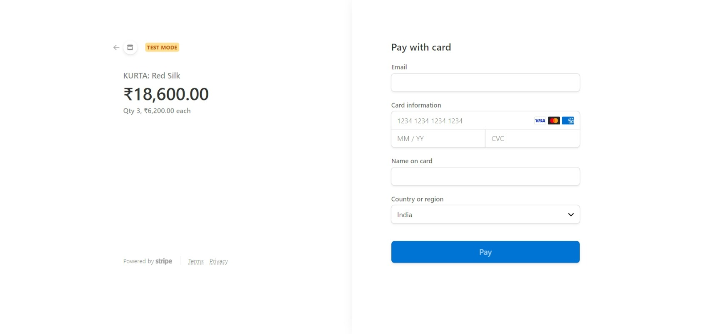

# Nayika - E-commerce Site 🛒

#### STORE DEMO :


#### STRIPE CHECKOUT :




## 🚀Getting Started with Create React App

This project was bootstrapped with [Create React App](https://github.com/facebook/create-react-app).

## Available Scripts

In the client project directory, you can run:

### `yarn start`

Runs the app in the development mode.
Open [http://localhost:3000](http://localhost:3000) to view it in your browser.

### `yarn test`

Launches the test runner in the interactive watch mode.
See the section about [running tests](https://facebook.github.io/create-react-app/docs/running-tests) for more information.

### `yarn build`

Builds the app for production to the `build` folder.
It correctly bundles React in production mode and optimizes the build for the best performance.

## 🚀 Getting started with Strapi

Strapi comes with a full featured [Command Line Interface](https://docs.strapi.io/developer-docs/latest/developer-resources/cli/CLI.html) (CLI) which lets you scaffold and manage your project in seconds.

In the api project directory, you can run:

### `develop`

Start your Strapi application with autoReload enabled. [Learn more](https://docs.strapi.io/developer-docs/latest/developer-resources/cli/CLI.html#strapi-develop)

```
npm run develop
# or
yarn develop
```

### `start`

Start your Strapi application with autoReload disabled. [Learn more](https://docs.strapi.io/developer-docs/latest/developer-resources/cli/CLI.html#strapi-start)

```
npm run start
# or
yarn start
```

### `build`

Build your admin panel. [Learn more](https://docs.strapi.io/developer-docs/latest/developer-resources/cli/CLI.html#strapi-build)

```
npm run build
# or
yarn build
```
